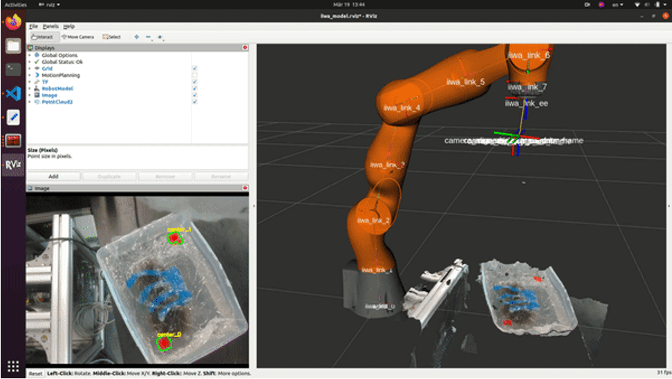
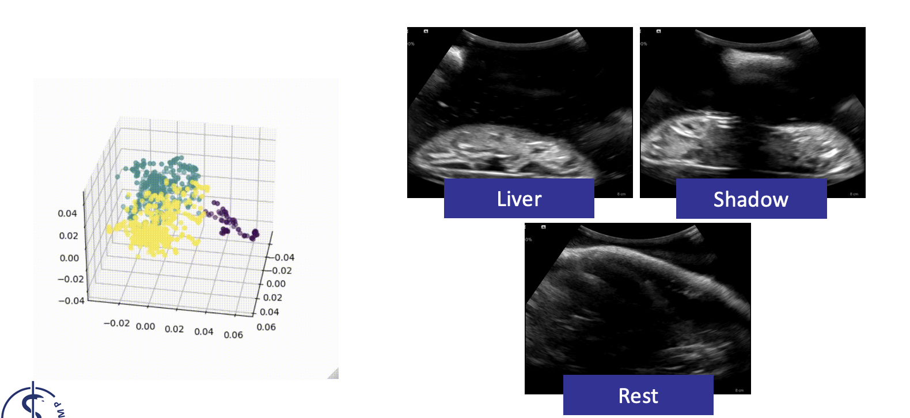
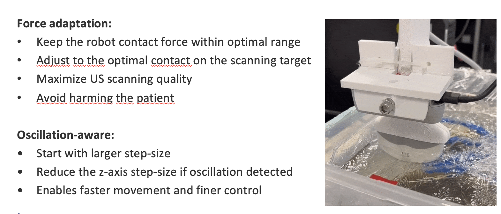
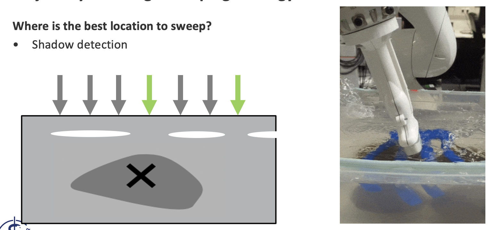

# Robotically-Guided Ultrasound System for 3D Liver Reconstruction
- Practical Course Computational Surgineering @ TUM, WS 22/23
- Group Members: Chengzhi Shen, Christian Engel, Mei-Ling Fang (based on name order)
- See [code](robotic-us), [report paper](report.pdf), [slides](presentation.pdf), [YouTube demo](https://www.youtube.com/watch?v=aPelV1jQPiw&feature=youtu.be)
 
## Features
### Initial Point Detection

### Shadow Detection

### Dynamic Trajectory Planning
#### Force adpation

#### Trajectory planning with sweeping motion

### Demo
[YouTube demo](https://www.youtube.com/watch?v=aPelV1jQPiw&feature=youtu.be)
